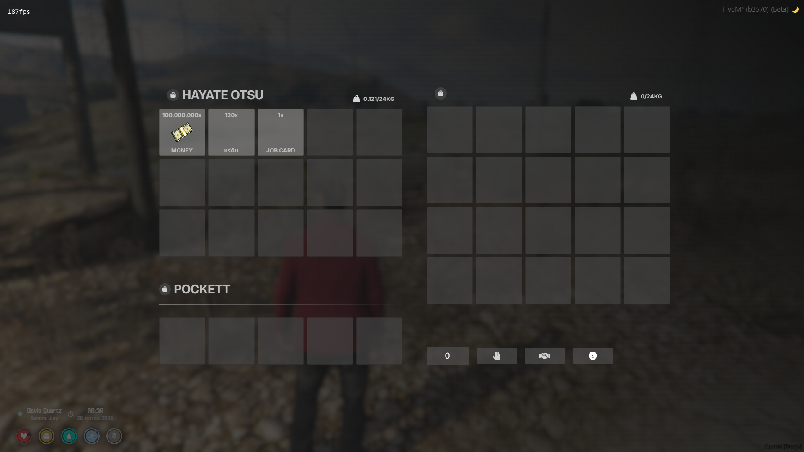

# ox_inventory

ระบบคลังไอเทมที่สมบูรณ์สำหรับ FiveM รองรับไอเทม อาวุธ ร้านค้า และอื่นๆ โดยไม่ต้องผูกกับเฟรมเวิร์กใดเฟรมเวิร์กหนึ่ง

## 📸 Preview Screenshot

## ⚠️ ข้อกำหนดสำคัญ

**ต้องใช้งานร่วมกับ [ox_lib v3.13.0](https://github.com/overextended/ox_lib/releases/tag/v3.13.0)**

## 📚 เอกสารประกอบ

https://overextended.dev/ox_inventory

## Supported Frameworks List

เราไม่รับประกันความเข้ากันได้หรือการสนับสนุนสำหรับทรัพยากรของบุคคลที่สาม

- [ox_core](https://github.com/overextended/ox_core)
- [esx](https://github.com/esx-framework/esx_core)
- [qbox](https://github.com/Qbox-project/qbx_core)
- [nd_core](https://github.com/ND-Framework/ND_Core)

## ✨ คุณสมบัติ

- ความปลอดภัยฝั่งเซิร์ฟเวอร์ที่ตรวจสอบการโต้ตอบกับไอเทม ร้านค้า และที่เก็บของทั้งหมด
- บันทึกเหตุการณ์สำคัญ เช่น การซื้อ การเคลื่อนย้ายไอเทม และการสร้างหรือลบไอเทม
- รองรับยานพาหนะของผู้เล่น ใบอนุญาต และระบบกลุ่มที่ใช้งานโดยเฟรมเวิร์ก
- ซิงโครไนซ์อย่างสมบูรณ์ ทำให้ผู้เล่นหลายคนสามารถ[เข้าถึงคลังเดียวกันได้](https://user-images.githubusercontent.com/65407488/230926091-c0033732-d293-48c9-9d62-6f6ae0a8a488.mp4)

## 📦 Item System

- ไอเทมในคลังจะถูกเก็บแยกตามช่อง พร้อมเมทาดาทาที่ปรับแต่งได้เพื่อรองรับความเป็นเอกลักษณ์ของไอเทม
- แทนที่ระบบอาวุธเริ่มต้นด้วยอาวุธในรูปแบบไอเทม
- ระบบอุปกรณ์เสริมและกระสุนอาวุธ รวมถึงกระสุนประเภทพิเศษ
- ความทนทาน ทำให้ไอเทมสามารถหมดหรือถูกลบออกเมื่อเวลาผ่านไป
- ระบบไอเทมภายในที่ให้การจัดการที่ปลอดภัยและง่ายดายสำหรับผลการใช้งานไอเทม
- เข้ากันได้กับการลงทะเบียนไอเทมของเฟรมเวิร์กบุคคลที่สาม

## 🏪 Store System

- จำกัดการเข้าถึงตามกลุ่มและใบอนุญาต
- รองรับสกุลเงินที่แตกต่างกันสำหรับไอเทม (เงินมืด ชิปโป๊กเกอร์ ฯลฯ)

## 🎒 Inventory System

- ที่เก็บของส่วนตัว เชื่อมโยงที่เก็บของกับตัวระบุเฉพาะหรือสร้างแบบต่อผู้เล่น
- จำกัดการเข้าถึงตามกลุ่ม
- ลงทะเบียนที่เก็บของใหม่จากทรัพยากรใดก็ได้
- คอนเทนเนอร์ทำให้สามารถเข้าถึงที่เก็บของเมื่อใช้ไอเทม เช่น ถุงกระดาษหรือเป้สะพายหลัง
- เข้าถึงช่องเก็บของในรถและกระโปรงท้ายสำหรับยานพาหนะใดก็ได้
- สร้างไอเทมแบบสุ่มภายในถังขยะและยานพาหนะที่ไม่มีเจ้าของ

## ลิขสิทธิ์

ลิขสิทธิ์ © 2024 [Overextended](https://github.com/overextended)

โปรแกรมนี้เป็นซอฟต์แวร์เสรี คุณสามารถเผยแพร่ต่อและ/หรือแก้ไขภายใต้เงื่อนไขของ GNU General Public License ตามที่เผยแพร่โดย Free Software Foundation ไม่ว่าจะเป็นเวอร์ชัน 3 ของใบอนุญาต หรือเวอร์ชันที่ใหม่กว่า (ตามตัวเลือกของคุณ)

โปรแกรมนี้ถูกเผยแพร่โดยหวังว่าจะมีประโยชน์ แต่ไม่มีการรับประกันใดๆ แม้แต่การรับประกันโดยนัยของการค้าหรือความเหมาะสมสำหรับวัตถุประสงค์เฉพาะ ดูรายละเอียดเพิ่มเติมได้ที่ GNU General Public License

คุณควรได้รับสำเนาของ GNU General Public License พร้อมกับโปรแกรมนี้ 
หากไม่ได้รับ [โปรดดูที่นี่](https://www.gnu.org/licenses/)

